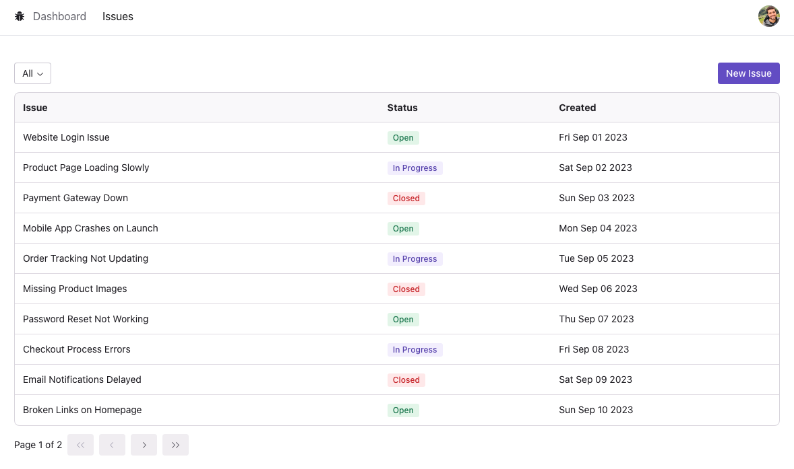

# Issue Tracker

The primary purpose of the Issue Tracking Dashboard is to provide a centralized platform for teams to log, track, and manage issues related to a project or software development. This includes bugs, feature requests, improvements, and other tasks.

## Screenshots


User Dashboard


Issues Table


## Technologies Used

- [React JS](https://reactjs.org/)
- [Next JS](https://nextjs.org/)
- [Typescript](https://www.typescriptlang.org/)
- [Tailwind CSS](https://tailwindcss.com/)
- SQL Database
- [Prisma](https://www.prisma.io/)

## Installation

1. Clone the repository:

   ```bash
   git clone https://github.com/matan3sh/issue-tracker.git
   ```

```bash
npm install

npm run dev
# or
yarn dev
# or
pnpm dev
```
